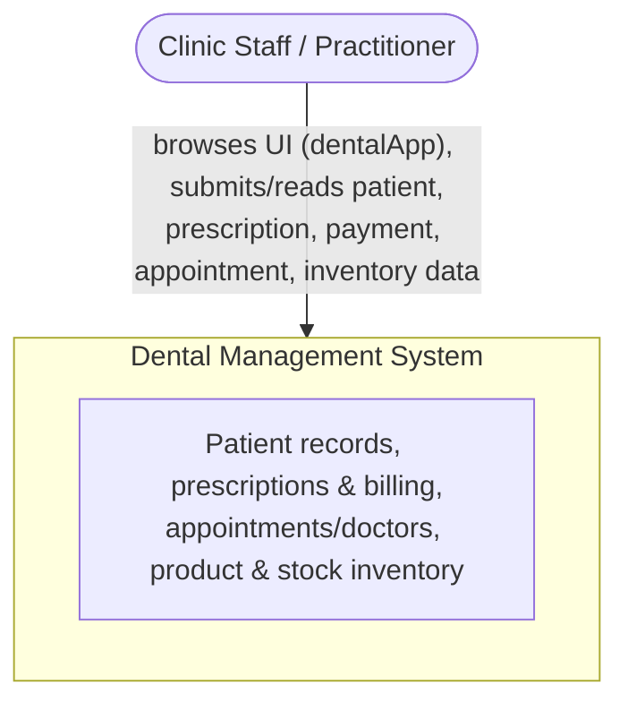
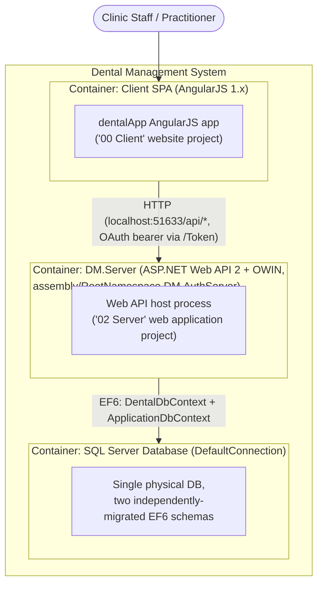
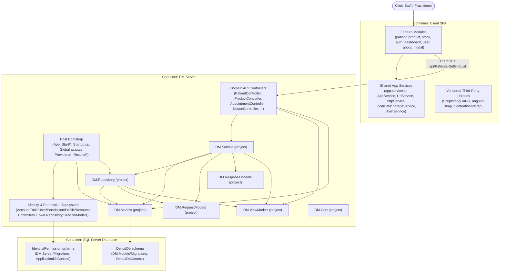

# Architecture Report: Dental Management System (DentalManagement.sln)

**Path analyzed:** C:\Learnings\Projects\legacy\dental-chamber\Source\App
**Date analyzed:** 2026-08-11

## System Context (L1)



- The analyzed system is a single-clinic dental-practice management application (browser client + Web API backend + SQL Server database) — `README.md` (one level up, at `C:\Learnings\Projects\legacy\dental-chamber\README.md`) titles it "Dental Management System (Prescription and Inventory)" and lists Core Technologies "Asp.Net Web API 2", "Unity DI", "Asp.Net Identity", "Repository Pattern", "Angularjs 1.x". This matches the entity set exposed in `DM.Models/DentalDbContext.cs` (`Patients`, `Prescriptions`, `PatientMedicalServices`, `Payments`, `Doctors`, `Appointments`, `Products`, `Inventories`) and the AngularJS feature folders under `Client/app/scripts/` (`patient/`, `product/`, `stock/`).
- One external actor is confirmed: a clinic staff/practitioner user interacting through a browser. `Client/index-dev.html` bootstraps AngularJS via `<html lang="en" ng-app="dentalApp">`, and `Client/app/scripts/app.service.js`'s `AppService.nextRoute()` branches routing on `user.RoleNames[0]` values `"SystemAdmin"`, `"Inventory"`, `"Admin"`, `"Manager"`, `"Doctor"`, `"Compounder"`, `"Patient"` — confirming the system is used by clinic staff with distinct roles, not by an anonymous public actor.
- No external third-party system is actively integrated. `DM.Server/App_Start/Startup.Auth.cs` references OWIN social-login packages (`Microsoft.Owin.Security.Facebook/.Google/.Twitter/.MicrosoftAccount`, confirmed present in the `DM.Server/DM.Server.csproj` manifest's `<Reference>` list), but every corresponding `app.UseFacebookAuthentication(...)`, `app.UseGoogleAuthentication(...)`, `app.UseTwitterAuthentication(...)`, and Microsoft-Account call in `Startup.Auth.cs`'s `ConfigureAuth(IAppBuilder app)` is commented out — so these are not drawn as external actors despite the package footprint. I found no payment-gateway, SMS, or email-provider integration in any file opened during this run.

## Containers (L2)



- **Client SPA** is a distinct deployable unit from `DM.Server`: `DentalManagement.sln` (manifest content) registers `Project("{E24C65DC-7377-472B-9ABA-BC803B73C61A}") = "Client", "Client\\"` as a Website project with its own `AspNetCompiler` deployment settings (`Debug.AspNetCompiler.PhysicalPath = "Client\\"`, `TargetPath = "PrecompiledWeb\\localhost_62262\\"`, `VWDPort = "62262"`), separate from `DM.Server`'s Web Application project type. Its content is hand-written AngularJS under `Client/app/scripts/` (confirmed by opening `Client/index-dev.html`, which bootstraps `ng-app="dentalApp"` and script-tags every feature module) and is built/minified by a Gulp pipeline (`Client/Gulpfile.js`, `Client/package.json` — `"name": "tilespad-dist"`, deps are all `gulp-*` plugins) rather than deployed as its own runtime process beyond static-asset hosting.
- **DM.Server** hosts the Web API: `DM.Server/DM.Server.csproj` sets `<RootNamespace>DM.AuthServer</RootNamespace>` and `<AssemblyName>DM.AuthServer</AssemblyName>` (the physical folder/project name `DM.Server` and its .NET namespace `DM.AuthServer` diverge — confirmed independently of the sibling codebase-report by reading the csproj manifest and `DM.Server/Global.asax.cs`, `DM.Server/Startup.cs`, both declared `namespace DM.AuthServer`). It is bootstrapped by `DM.Server/Global.asax.cs`'s `WebApiApplication.Application_Start()` (`UnityConfig.RegisterComponents(); AreaRegistration.RegisterAllAreas(); GlobalConfiguration.Configure(WebApiConfig.Register); FilterConfig.RegisterGlobalFilters(...); RouteConfig.RegisterRoutes(...); BundleConfig.RegisterBundles(...);`) plus an OWIN pipeline registered via `[assembly: OwinStartup(typeof(DM.AuthServer.Startup))]` in `DM.Server/Startup.cs`, whose `Configuration(IAppBuilder app)` calls `ConfigureAuth(app)` (defined in `DM.Server/App_Start/Startup.Auth.cs`) to wire cookie auth, OAuth bearer tokens (`TokenEndpointPath = new PathString("/Token")`), and per-request `ApplicationDbContext`/`ApplicationUserManager` instances. Its own csproj records `<DevelopmentServerPort>51633</DevelopmentServerPort>` and `<IISUrl>http://localhost:51633/</IISUrl>`.
- **SQL Server Database**: a single physical database reached through two independently-migrated EF6 `DbContext`s registered side by side in `DM.Server/App_Start/UnityConfig.cs` — `container.RegisterType<DbContext, ApplicationDbContext>(new HierarchicalLifetimeManager());` and `container.RegisterType<DbContext, DentalDbContext>(new HierarchicalLifetimeManager());` — both bound to the same named connection string: `DM.Models/DentalDbContext.cs`'s constructor calls `base("name=DefaultConnection")`, and `DM.Server/Models/ApplicationDbContext.cs`'s constructor calls `base("DefaultConnection", throwIfV1Schema: false)`. `DentalDbContext`'s static constructor explicitly disables EF's own safety check with the comment "The schema is owned by ApplicationDbContext's migrations, so skip EF's model-hash check for this context." followed by `Database.SetInitializer<DentalDbContext>(null);`. ⚠ PROVISIONAL — pending PQ-002 (proposed default: consolidate into a single context/schema in the rebuild target) on whether this two-context split should be preserved, consolidated, or formally separated in a rebuild target.
- **Client → DM.Server** is confirmed end-to-end, not inferred: `Client/app/scripts/app.service.js`'s `UrlService` sets `self.url = "http://localhost:51633/"` (matching DM.Server's own dev port above) and builds `self.urls.baseApi = self.url + "api/"` plus per-feature URLs (e.g. `PatientUrl = baseApi + "Patients"`). `Client/app/scripts/patient/patient.controller.js` then calls `$http.get(urlService.PatientUrl + "/GetGridList")`, which matches `DM.Server/Controllers/PatientController.cs`'s `[RoutePrefix("api/Patients")]` + `[HttpGet] [Route("GetGridList")]` exactly. The `dependency_graph` collected fact does not carry this edge (it only covers `.csproj` project references), so this container-to-container edge rests entirely on the two opened files just cited, per the task framing's own note that this edge must be established from source.
- `DM.Server.Tests` (registered in `DentalManagement.sln` under solution folder "02 Server", `DM.Server.Tests/DM.Server.Tests.csproj` manifest confirms `TestProjectType>UnitTest</TestProjectType>` referencing legacy `Microsoft.VisualStudio.QualityTools.UnitTestFramework`) is a real project on disk but is not a runtime-deployable container, so it is excluded from this diagram. The collected facts' `test_locations` array came back empty for this repo — a collector gap, not evidence the test project doesn't exist (it does, per the `.sln` and `.csproj` manifest).

## Components (L3)



**Client SPA components:**
- `Feature Modules` — one folder per business area under `Client/app/scripts/` (`about/`, `auth/`, `dashboard/`, `modal/`, `patient/`, `product/`, `stock/`, `user/` — listed via directory enumeration and confirmed by `Client/index-dev.html`'s `<script>` includes, e.g. `app/scripts/patient/patient.config.js`, `patient.controller.js`, `patient.service.js`). I opened `Client/app/scripts/patient/patient.controller.js` and `Client/app/scripts/patient/patient.service.js` directly: the controller injects `"$scope", "$state", "$http", "AppService", "PatientService", "LocalDataStorageService", "UrlService"` and calls `$http.get(urlService.PatientUrl + "/GetGridList")`, while `PatientService` itself just holds simple cross-controller state (`PrescriptionId`, `PatientId`, `PageName`).
- `Shared App Services` — `Client/app/scripts/app.service.js` (opened directly) defines `AppService` (post-login routing by role), `UrlService` (the API base-URL/per-endpoint URL table), `AlertService` (toast/modal alert helper built on `$uibModal`), `LocalDataStorageService` (localStorage-backed token/user/role persistence), and `HttpService` (a thin `$http` GET/POST/PUT/DELETE wrapper returning `$q` promises) — used across feature modules per the `patient.controller.js` injection list above.
- `Vendored Third-Party Libraries` — `Client/Scripts/angular-ui/`, `Client/Scripts/angular-strap/`(per `top_level_dirs`/directory listing) and `Client/Content/bootstrap/` are vendored, unminified-by-the-app third-party code pulled in via plain `<script>`/`<link>` tags in `Client/index-dev.html` (e.g. `Scripts/angular-ui/angular-ui-router.min.js`, `Content/bootstrap/bootstrap.min.css`), not through the app's own `Client/package.json` (which is Gulp build tooling only, confirmed by its `dependencies` list being entirely `gulp-*`/`jshint` packages). No further internal edges are drawn for this component — I found no evidence any Feature Module or Shared App Service file has been modified from the vendored library's shipped form.

**DM.Server components** (all boundaries below are grounded in the `DM.Server/DM.Server.csproj` manifest's `<Compile Include>` list plus the specific files opened):
- `Host Bootstrap` — `App_Start/UnityConfig.cs`, `App_Start/WebApiConfig.cs`, `App_Start/RouteConfig.cs`, `App_Start/FilterConfig.cs`, `App_Start/BundleConfig.cs`, `App_Start/IdentityConfig.cs`, `App_Start/Startup.Auth.cs`, `Startup.cs`, `Global.asax.cs`, `Providers/ApplicationOAuthProvider.cs`, `Providers/CorsPolicyFactory.cs`, `Results/ChallengeResult.cs`. I opened `Global.asax.cs`, `Startup.cs`, `App_Start/UnityConfig.cs`, and `App_Start/Startup.Auth.cs` directly (quoted above under L2).
- `Domain API Controllers` — the non-identity controllers listed in the csproj: `AppointmentController`, `DashboardController`, `DoctorController`, `InventoryController`, `InventoryReportController`, `MedicalInfoController`, `MedicalServiceController`, `PatientController`, `PatientCreateController`, `PatientDetailController`, `PatientMedicalServiceController`, `PatientReportController`, `PaymentController`, `PrescriptionController`, `ProductController`, `ValuesController`. I opened `PatientController.cs` and `BaseController.cs` (the generic CRUD base every non-identity controller likely extends, per `BaseController<TEntity> : ApiController, IBaseController<TEntity>` with `Get()/Get(string)/Post/Put/Delete` delegating to an injected `IBaseService<TEntity>`) directly.
- `Identity & Permission Subsystem` — `Controllers/AccountController.cs`, `RoleController.cs`, `UserController.cs`, `PermissionController.cs`, `ProfileController.cs`, `ResourceController.cs`, plus its own `Repository/PermissionRepository.cs`, `Repository/ProfileRepository.cs`, `Repository/ResourceRepository.cs`, `Repository/RoleRepository.cs`, `Repository/UserRepository.cs`, `Service/ProfileService.cs`, `Service/ResourceService.cs`, `Service/PermissionService.cs`, `Service/RoleService.cs`, `Service/UserService.cs`, and `Models/ApplicationDbContext.cs`, `Models/IdentityModels.cs`, `Models/SecurityModels.cs`, `Models/AccountBindingModels.cs`, `Models/AccountViewModels.cs`, `Models/RequestModels.cs`, `Models/UserViewModels.cs`, `Models/ViewModels.cs` (all from the csproj manifest's compile list). I opened `Models/ApplicationDbContext.cs` directly (`IdentityDbContext<ApplicationUser>` plus `DbSet<SecurityModels.Resource> Resources` and `DbSet<SecurityModels.Permission> Permissions`) — confirming identity, role/permission, and resource concerns are implemented inside this one project rather than through the `DM.Repository`/`DM.Service` layering used by the rest of the domain.
- `DM.Service`, `DM.Repository`, `DM.Models`, `DM.RequestModels`, `DM.ResponseModels`, `DM.ViewModels` — each a separate `.csproj` class-library project (not an independently deployable container; all compile into `DM.Server`'s output). Their edges above are taken directly from the collected `dependency_graph` (`DM.Repository → DM.Models, DM.RequestModels, DM.ViewModels`; `DM.Service → DM.Models, DM.Repository, DM.RequestModels, DM.ResponseModels, DM.ViewModels`).
- `DM.Core` (`AppConstants.cs`, `AppSettingsDto.cs`, `AppSettingsKey.cs`) is referenced by the `DM.Server` project per `dependency_graph` (`DM.Server/DM.Server.csproj → DM.Core/DM.Core.csproj`), but I did not open any file that imports it, so no inbound edge from a specific component is drawn — the node is included for completeness, but its consumer within `DM.Server` is unconfirmed.
- `domainControllers → dmService`, `domainControllers → dmViewModels`, `domainControllers → dmModels`: from `PatientController.cs`, opened directly — `using DM.Service.Contacts;` (constructor-injects `IPatientCreateService`, `IPrescriptionService`), `using DM.ViewModels;` (`PatientGridViewModel`), `using DM.Models;` (`Patient`, `Prescription`).
- `hostBootstrap → identitySubsystem`, `hostBootstrap → dmModels`, `hostBootstrap → dmRepository`: from `App_Start/UnityConfig.cs`, opened directly — `using DM.AuthServer.Models;` (registers `ApplicationDbContext`), `using DM.Models;` (registers `DentalDbContext`), `using DM.Repository.Contacts;`.
- `dmModels → dentalSchema`, `identitySubsystem → identitySchema`: from `DM.Models/DentalDbContext.cs` and `DM.Server/Models/ApplicationDbContext.cs`, both opened directly and quoted under L2 (each context owns its own `Migrations/` history against the one shared "DefaultConnection" database).

**SQL Server Database components:** two logical, independently-migrated schema histories sharing one physical database, per the L2 evidence above — `DentalDb schema` (owned by `DM.Models/Migrations/*`, reached only via `DentalDbContext`) and `Identity/Permission schema` (owned by `DM.Server/Migrations/*`, reached only via `ApplicationDbContext`). ⚠ PROVISIONAL — pending PQ-002 on whether this split should persist in a rebuild target.

## Code (L4)

```mermaid
flowchart TD
  subgraph PatientController["PatientController : ApiController<br/>[Authorize] [RoutePrefix(\"api/Patients\")]"]
    ctor["Constructor(IPatientCreateService, IPrescriptionService)"]
    getMethod["Get()<br/>[HttpGet] [Route(\"GetGridList\")]"]
    searchMethod["Search(string request)<br/>[HttpGet] [Route(\"Search\")]"]
  end
  deserialize["JsonConvert.DeserializeObject&lt;PatientSearchRequestModel&gt;(request)"]
  getAll["_patientCreateService.GetAll()"]
  lastRx["_prescriptionService.GetPatientCurrentPrescription(patient.Id).Last()<br/>(per patient, inside foreach)"]
  buildVm["build PatientGridViewModel per patient<br/>(identical ~25-line block duplicated in Get() and Search())"]
  sortTake["OrderByDescending(x =&gt; x.LastVisitingDate).Take(100)<br/>(Get() only)"]
  filterKey["filter by FilterId 0/1/2 on Code/Name/Phone/TotalDue<br/>(Search() only, no sort/cap)"]

  ctor --> getMethod
  ctor --> searchMethod
  getMethod --> getAll
  searchMethod --> deserialize
  searchMethod --> getAll
  getAll --> lastRx
  lastRx --> buildVm
  buildVm --> sortTake
  buildVm --> filterKey
```

**Component chosen: `Domain API Controllers`, zoomed into `DM.Server/Controllers/PatientController.cs` (opened directly).** This meets the L4 Judgment Rule on two counts: (1) it is a disproportionately central/risky node — the same sibling `codebase-report.md` independently names it the first place to start onboarding work, and (2) its internal structure is non-obvious from its name/location alone: a controller named for simple CRUD instead performs a full N+1 join against `DM.Service`'s prescription service on every request, duplicated verbatim across two endpoints.

- `Get()` and `Search(string request)` each call `List<Patient> patients = _patientCreateService.GetAll();`, then inside a `foreach (Patient patient in patients)` call `_prescriptionService.GetPatientCurrentPrescription(patient.Id).Last();` to populate `LastVisitingDate`, `TotalPayable`, `TotalPaid`, `TotalDue` on a `PatientGridViewModel` — one extra database round-trip per patient (N+1), and `.Last()` on what could be an empty sequence for a patient with zero prescriptions throws `InvalidOperationException` uncaught by either method. ⚠ PROVISIONAL — pending PQ-001 (proposed default: treat as a defect to fix in the rebuild) on whether this is a live risk or a non-issue under an unconfirmed "every patient always has ≥1 prescription" invariant.
- `Get()` and `Search()` duplicate the entire patient/prescription-join/view-model-construction block verbatim (lines 30–53 and 66–87 of the opened file are near-identical) rather than sharing a private helper method — a maintenance-cost finding distinct from the N+1/`.Last()` risk above, confirmed purely by reading the file (no PQ needed; it is not ambiguous).
- The two endpoints are asymmetric in a way that is directly observable in the code (not uncertain, so no PQ): `Get()` applies `.OrderByDescending(x => x.LastVisitingDate).Take(100)` before returning, capping and sorting the grid; `Search()` returns the filtered `IEnumerable<PatientGridViewModel>` with no equivalent sort or cap. `Search()` additionally deserializes its `request` parameter via `JsonConvert.DeserializeObject<PatientSearchRequestModel>(request)` before filtering on `FilterId` (0 = all, 1 = has due balance via `Math.Abs(x.TotalDue) > 0`, 2 = fully paid via `Math.Abs(x.TotalDue) <= 0`).

For every other component identified in the L3 diagram, L4 is not warranted:

- `Feature Modules` (Client) — L4 not warranted for this component.
- `Shared App Services` (Client) — L4 not warranted for this component.
- `Vendored Third-Party Libraries` (Client) — L4 not warranted for this component.
- `Host Bootstrap` (DM.Server) — L4 not warranted for this component.
- `Identity & Permission Subsystem` (DM.Server) — L4 not warranted for this component.
- `DM.Service` (project) — L4 not warranted for this component.
- `DM.Repository` (project) — L4 not warranted for this component.
- `DM.Models` (project) — L4 not warranted for this component.
- `DM.RequestModels` (project) — L4 not warranted for this component.
- `DM.ResponseModels` (project) — L4 not warranted for this component.
- `DM.ViewModels` (project) — L4 not warranted for this component.
- `DM.Core` (project) — L4 not warranted for this component.
- `DentalDb schema` (SQL Server Database) — L4 not warranted for this component.
- `Identity/Permission schema` (SQL Server Database) — L4 not warranted for this component.
