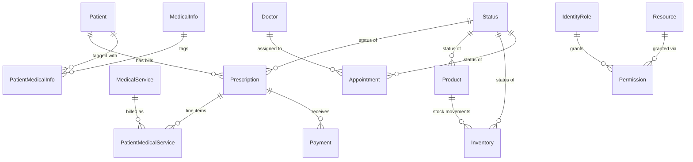

# Domain Model: Dental Management System (DentalManagement.sln)

**Path analyzed:** C:\Learnings\Projects\legacy\dental-chamber\Source\App
**Date analyzed:** 2026-08-11

## Entities

All entities below come from Entity Framework 6 classes opened directly in `DM.Models/*.cs` and `DM.Server/Models/*.cs` (the collector's `type_declarations[]` came back empty for this stack — this is an ASP.NET Web API 2 + AngularJS app, not the Delphi/WinForms shape the collector heuristics target). Two independently-migrated `DbContext`s hold these entities against one physical database (`DentalDbContext` for the domain schema, `ApplicationDbContext` for the Identity/permission schema) — see `architecture.md` and `pending-questions.md` PQ-002.

### Domain schema (`DentalDbContext`, `DM.Models/*.cs`)

1. **Patient** (`DM.Models/Patient.cs`) — `Code` (string, `[StringLength(8,MinimumLength=7)]`, unique index `IX_Code`), `Name` (required, 3–30 chars), `Age` (required int), `Phone`, `Email`, `Address`, `Gender` (plain `string`, **not** the `Gender` enum declared in the same file — see Named Gaps), `Note`, `Created`, `LastUpdate`, `Prescriptions` (collection).
   Inference: the clinic's patient/customer record. `Code` is the human-facing patient identifier used in the SPA's URL (`root.patient-detail` state regex `/patient/{patientId:[P]+[0-9]{1,30}}`) and on printed receipts.

2. **Prescription** (`DM.Models/Prescription.cs`) — `Code` (string, 12–18 chars, unique index), `PatientId` (FK → Patient), `TotalCharge`, `DiscountPercent`, `DiscountAmount`, `FixedDiscount` (default 0), `TotalDiscountAmount` (computed property, `DiscountAmount + FixedDiscount`), `TotalPayable`, `TotalPaid`, `TotalDue`, `Created`, `LastUpdate`, `StatusId` (FK → Status), `PatientMedicalServices` (collection), `Payments` (collection).
   Inference: despite the name, this functions as a patient's running **bill/visit tab**, not a pharmacological prescription — it accumulates service charges, discounts, and payments for one open visit. `StatusId` 5 ("Active") vs 6 ("Closed") — confirmed via `DM.Models/Migrations/Configuration.cs`'s `AddStatus()` seed list, in insertion order — gates whether it is the patient's "current" bill (`PrescriptionController.GetPatientCurrentPrescription` filters `.LastOrDefault(x => x.StatusId == 5)`).

3. **PatientMedicalService** (`DM.Models/PatientMedicalService.cs`) — join entity: `PatientId` (FK), `PrescriptionId` (FK), `MedicalServiceId` (FK), `Quantity` (default 1), `Created`, `LastUpdate`, navigation to `Patient`/`Prescription`/`MedicalService`.
   Inference: one line-item of a dental service/treatment billed to a patient within one Prescription (bill).

4. **MedicalService** (`DM.Models/MedicalService.cs`) — `Code` (auto-increment int, unique index), `Name` (required, unique, 2–50 chars), `Charge` (`[DataType(DataType.Currency)]` but declared `string`), `Created`, `LastUpdate`, `[NotMapped] Quantity` (default 1), `[NotMapped] TotalCharge` (`Convert.ToInt32(Charge) * Quantity`).
   Inference: the clinic's priced catalog of dental treatments/services (e.g. "Scaling", "Extraction") that can be added to a patient's bill.
   Field Semantics (domain-model half): `Charge` is a monetary value whose **stored type is `string`, not a numeric currency type** — its content diverges from its declared type. `TotalCharge` derives it via `Convert.ToInt32(Charge)`, which truncates any fractional currency amount and throws for a non-integer string. See DR-019.

5. **MedicalInfo** (`DM.Models/MedicalInfo.cs`) — `Name` (required, unique, 2–50 chars), `Created`, `LastUpdate`, `[NotMapped] IsChecked`.
   Inference: master list of medical conditions/allergies (e.g. "Diabetic") that can be tagged onto a patient's record.

6. **PatientMedicalInfo** (`DM.Models/PatientMedicalInfo.cs`) — join entity: `PatientId`, `MedicalInfoId` (both plain `Guid`, no `[ForeignKey]`/navigation declared, unlike the other join entities).
   Inference: many-to-many link recording which medical conditions apply to which patient.

7. **Payment** (`DM.Models/Payment.cs`) — `PrescriptionId` (FK), `Amount` (double), `Comment`, `Created`, `LastUpdate`, navigation to `Prescription`.
   Inference: one payment/receipt applied against a patient's bill.

8. **Product** (`DM.Models/Product.cs`) — `Code`, `Name` (required, unique, 1–40 chars), `StartingInventory`, `Received`, `Shipped`, `OnHand`, `MinimumRequired`, `UnitPrice`, `SalePrice`, `Created`, `LastUpdate`, `StatusId` (FK → Status), `Inventories` (collection).
   Inference: a stocked clinic/dental consumable tracked for inventory. `StatusId` 1 ("In Stock") / 2 ("Out Of Stock") is derived from `OnHand`'s sign by client code (`stock.controller.js`'s `updateProduct()`), not enforced server-side.

9. **Inventory** (`DM.Models/Inventory.cs`) — `Created`, `ProductId` (FK), `CashMemoNo` (required), `OnHand`, `ReceivedOrShippedQuantity`, `LastUpdate`, `StatusId` (FK → Status; observed values 3 "Received" / 4 "Shipped"), navigation to `Product`/`Status`.
   Inference: a single stock-movement transaction (goods received or shipped) for a product, storing a snapshot of `OnHand` at the moment of the movement.

10. **Doctor** (`DM.Models/Doctor.cs`) — `Code`, `Name`, `Phone`, `Created`, `LastUpdate`, `Appointments` (collection).
    Inference: a clinic doctor/practitioner assignable to appointments. No create/update/delete endpoint exists on `DoctorController` (`GetAll`/`GetById` only) — the seed data (`DM.Server`... actually `DM.Models/Migrations/Configuration.cs`'s `AddDoctor()`) inserts exactly **one** doctor (`Code="DR001"`, `Name="Dental Doctor"`, `Id=9b6ba3ad-c9be-e511-9bf4-402cf40f4b2f`), and that exact GUID is hardcoded as the default `DoctorId` in `Client/app/scripts/patient/patient-appointment.controller.js`'s `init()` — confirming this system was built/seeded for a **single-doctor** clinic despite the data model supporting many doctors.

11. **Appointment** (`DM.Models/Appointment.cs`) — `Code`, `PatientNameOrId` (free-text string, required, 2–40 chars — **not** a `Patient` FK), `Age` (required int), `Phone`, `Date`, `Time`, `Created`, `LastUpdate`, `DoctorId` (FK → Doctor), `StatusId` (FK → Status; observed values 7 "Appointed" / 8 "Visited").
    Inference: a scheduled visit slot, deliberately decoupled from the `Patient` entity — `PatientNameOrId` lets staff book a slot for someone not yet registered as a `Patient` record. `AppointmentRepository.GetByDate` only returns rows with `StatusId == 7` (see DR-010).

12. **Status** (`DM.Models/Status.cs`) — `Id` (int, identity PK), `Name` (required).
    Inference: a single shared lookup table reused, with different meanings per foreign key, across four unrelated entities. Confirmed exact seed order/names from `DM.Models/Migrations/Configuration.cs`'s `AddStatus()`: `1=In Stock, 2=Out Of Stock, 3=Received, 4=Shipped, 5=Active, 6=Closed, 7=Appointed, 8=Visited`. See the Enumerations section — this behaves exactly like an enum at the application level even though it is a DB table, not a C# `enum`.

### Identity/permission schema (`ApplicationDbContext`, `DM.Server/Models/*.cs`, namespace `DM.AuthServer.Models`)

13. **ApplicationUser** (`DM.Server/Models/IdentityModels.cs`) — extends ASP.NET Identity's `IdentityUser` with `FirstName`, `LastName`. Standard Identity columns (`UserName`, `Email`, `PasswordHash`, `SecurityStamp`, …) plus `Roles` (via `IdentityUserRole`).
    Inference: a clinic-staff login account. Every seeded user (`DM.Server/Migrations/Configuration.cs`'s `AddUsers()`) is assigned exactly one role in practice, even though the underlying model allows many.

14. **IdentityRole** (ASP.NET Identity framework type, referenced directly — no custom subclass). Seeded role names (`AddRoles()`): `SystemAdmin, Admin, Manager, User, Inventory, Patient, Doctor, Compounder` — see Enumerations.

15. **SecurityModels.Resource** (`DM.Server/Models/SecurityModels.cs`) — `Id` (string PK), `Name`, `Route` (required — matches an AngularJS UI-Router state name, e.g. `"root.patient"`), `IsPublic` (required bool).
    Inference: a catalog of protected screens/routes. Seeded list (`AddResources()`) enumerates 22 named routes one-for-one with the UI-Router states found in `Client/app/scripts/**/*.config.js` (see Cross-Module References / Module Dependencies — every other module's screens are catalogued here).

16. **SecurityModels.Permission** (`DM.Server/Models/SecurityModels.cs`) — `Id` (string PK), `RoleId`/`RoleName` (denormalized), `ResourceId`, navigation to `AspNetRole`/`Resource`.
    Inference: a grant of one `Resource` (screen/route) to one `IdentityRole`. This is the join table the whole authorization model runs on (DR-015).

## Relationships

Every edge above traces to a `[ForeignKey(...)]` attribute or navigation property opened directly in `DM.Models/*.cs` or `DM.Server/Models/SecurityModels.cs`. Cardinalities are drawn as the code states them (a required scalar FK on the "many" side, a `ICollection<T>` navigation on the "one" side) — none are guessed beyond what EF's own attributes/collections declare.

Two relationships that a reader might expect are **deliberately absent**, and I confirmed their absence rather than assuming it:
- **Appointment ↔ Patient**: `Appointment.PatientNameOrId` is a free-text `string`, not a `Guid` FK to `Patient` — there is no code path anywhere in `DM.Repository`/`DM.Service`/the controllers that joins an `Appointment` to a `Patient` row. Appointments and patient records are entirely independent data.
- **ApplicationUser ↔ Patient/Prescription/etc.**: the Identity schema (`ApplicationUser`, `IdentityRole`, `Resource`, `Permission`) has no foreign key into the domain schema (`Patient`, `Product`, …) anywhere I opened. The two schemas are linked only by sharing one physical database connection string (`DefaultConnection`) — see `pending-questions.md` PQ-002 — not by any relational reference.

`IdentityUserRole` (the `ApplicationUser`↔`IdentityRole` join) is a framework type I did not open directly; it is used exactly as ASP.NET Identity's own convention dictates (`user.Roles = { new IdentityUserRole { RoleId = ..., UserId = ... } }` in `DM.Server/Service/UserService.cs`), so I did not add a separate ER node for it — it is standard Identity plumbing, not a domain-specific relationship.

## Business Rules

<!--
  Every business rule carries a permanent DR-NNN ID, assigned in the order
  rules are found, e.g.:

  1. **DR-007 — Promised-vs-delivered verdict computation** — <rule prose>

  (or the closest fit to this document's existing heading/list style — the
  ID is the stable part, not the surrounding markdown shape). DR-NNN IDs
  are permanent identifiers, not position — a later re-run may find rules
  in a different order, but an already-assigned ID is never reused or
  renumbered. A new rule takes the next free ID. A rule that no longer
  applies leaves a tombstone in place rather than disappearing, e.g.:

  4. **DR-004 — withdrawn 2026-08-01, superseded by DR-015**

  so that any other document citing DR-004 (clarifications.md, a rebuild
  backlog item, a golden-master scenario) fails loudly instead of silently
  pointing at whatever rule happens to occupy that position now.

  PROVISIONAL marker: whenever an entity field, business rule, or
  enumeration meaning can't be evidenced (see the analyst agent's own
  "Ask, Don't Guess" triggers T1-T6), the affected line carries
  `⚠ PROVISIONAL — pending PQ-NNN (proposed default: <x>)` appended after
  its text — e.g. a field's capture widget renders as
  `PROVISIONAL(PQ-004, default: text)` rather than a bare `text`. This is
  soft-block, not an omission: the finding is still fully documented
  (a Named Gap, an Inference: line, or the Mechanical Recording Rule still
  apply exactly as before), the marker just makes the uncertainty
  mechanically traceable into rebuild-backlog.md/scenarios.md/manifest.json
  downstream instead of relying on someone noticing the prose. It clears
  automatically the next time this document is regenerated after the
  underlying PQ-NNN/CQ-NNN is answered under decisions.md's ## Decisions.
-->

This is a first-ever generation of this document (no prior `domain-model.md` existed to reconcile DR-IDs against), so all IDs below are freshly assigned in discovery order.

1. **DR-001 — Patient Code is auto-generated, unique, human-facing** — `Code` is computed server-side as `"P" + zero-padded sequence`, never client-supplied (`DM.RequestModels/HelperRequestModel.cs`'s `GetThisPatientCode`, called from `PatientCreateController.Post`), and enforced unique via `DentalDbContext.OnModelCreating`'s `HasIndex(p => p.Code).IsUnique()` plus `Patient.cs`'s `[StringLength(8,MinimumLength=7)]`.
2. **DR-002 — New patient is auto-provisioned with an initial bill** — `PatientCreateController.Post` creates the `Patient`, then, if no `Prescription` yet exists for that `PatientId`, creates one with `StatusId = 5` ("Active"). Not wrapped in a database transaction — if the second write fails, the patient exists with zero bills. This is direct supporting evidence for the open question in `pending-questions.md` PQ-001 about whether every `Patient` is guaranteed ≥1 `Prescription`.
3. **DR-003 — Bill code format** — a Prescription's `Code` is generated as `"BILL" + zero-padded sequence + "-" + PatientCode` (`HelperRequestModel.GenerateBillCode`, called from both `PatientCreateController.Post` and `PrescriptionController.Post`).
4. **DR-004 — Discount percent must be 0–100** — enforced only in `Client/app/scripts/patient/patient-create.controller.js`'s `calculateDiscount()` (toast: "Discount must be between 0% to 100%"); `Prescription.cs`'s `DiscountPercent` carries no server-side `[Range]` annotation and `PrescriptionController.Put` performs no validation of it.
5. **DR-005 — A payment cannot exceed the bill's current due amount** — enforced only in `Client/app/scripts/patient/patient-detail.controller.js`'s `savePayment()` (toast: "You are trying to paid more then due amount"); `PaymentController.Post` performs no equivalent server-side check.
6. **DR-006 — A bill cannot be closed to open a new one while due > 0, unless forced** — `patient-detail.controller.js`'s `newBill()` blocks (toast) when `patientPrescription.TotalDue > 0`; `forceNewBill()` is an explicit escape hatch that skips the check. Client-side only.
7. **DR-007 — Closing a bill immediately opens a new one** — see Workflows, "Close Bill / Open New Bill".
8. **DR-008 — A "Shipped" stock movement cannot exceed the product's current on-hand quantity** — enforced only in `Client/app/scripts/stock/stock.controller.js`'s `save()` (alert: "You are trying to shipped more then your stock"); `InventoryController.Post` performs no equivalent check.
9. **DR-009 — Recording a stock movement updates the product's running totals** — see Workflows, "Record Stock Movement & Update Product Levels".
10. **DR-010 — mechanical, reason not evident** — `AppointmentRepository.GetByDate` filters to `x.StatusId == 7` ("Appointed") only, excluding "Visited" (8) appointments from the by-date list; no comment explains why visited appointments are hidden from this particular query.
11. **DR-011 — A user cannot delete their own account** — `DM.Server/Controllers/UserController.cs`'s `DeleteUser` returns `BadRequest()` when `HttpContext.Current.User.Identity.GetUserId() == id`.
12. **DR-012 — New/updated user passwords must be confirmed** — `DM.Server/Service/UserService.cs`'s `CreateUser`/`UpdateUser` compare `model.PasswordHash` to `model.RetypePassword` and abort the write if they differ (mirrored client-side in `Client/app/scripts/user/user.controller.js`).
13. **DR-013 — Changing your own password requires the current password** — `DM.Server/Service/ProfileService.cs`'s `UpdatePassword` verifies `PasswordHasher().VerifyHashedPassword(...)` against the supplied `CurrentPassword` before accepting the change, and separately requires `NewPassword == RetypePassword`.
14. **DR-014 — SystemAdmin is hidden from non-SystemAdmin viewers** — `DM.Server/Service/RoleService.cs`'s `GetAll()` removes the "SystemAdmin" role from the list, and `DM.Server/Service/UserService.cs`'s `GetUsers()` removes users holding that role, whenever the caller (`HttpContext.Current.User`) is not itself in the SystemAdmin role.
15. **DR-015 — Screen/route access requires a public resource or an explicit permission** — `DM.Server/Service/PermissionService.cs`'s `CheckPermission`: if the matched `Resource.IsPublic` is true, access is granted unconditionally; otherwise, access is granted only if a `Permission` row exists for the caller's role + that resource. Invoked on every AngularJS state transition via `Client/app/scripts/app.config.js`'s `$stateChangeStart` → `AuthService.authorize`.
16. **DR-016 — Fresh installs grant permissions only to SystemAdmin** — `DM.Server/Migrations/Configuration.cs`'s `AddPermissions()` seeds `Permission` rows only for the `SystemAdmin` role against every private `Resource`; every other seeded role (`Admin, Manager, User, Inventory, Patient, Doctor, Compounder`) starts with zero granted resources until a SystemAdmin explicitly grants them via the Permission screen.
17. **DR-017 — Catalog names must be unique** — `MedicalService.Name` and `MedicalInfo.Name` both carry `[Required][StringLength(50,MinimumLength=2)]` plus a unique index (`IX_Name`).
18. **DR-018 — Saving a bill's service list replaces rather than merges** — `DM.Repository/PatientMedicalServiceRepository.cs`'s `AddList` deletes every existing `PatientMedicalService` row for the **first** submitted item's `PrescriptionId` (the `foreach` loop `break`s after processing one item), then inserts every item in the new list. This is correct only because its one caller (`PatientMedicalServiceController.CreateList`) always submits a list scoped to a single `PrescriptionId` — nothing in the type system enforces that assumption.
19. **DR-019 — mechanical, reason not evident** — `MedicalService.TotalCharge` (`[NotMapped]`) is computed as `Convert.ToInt32(Charge) * Quantity`, even though `Charge` is declared `[DataType(DataType.Currency)] string`. This truncates any fractional currency value and throws `FormatException` for a non-integer `Charge` string; no comment explains the choice of `int` over a decimal type.
20. **DR-020 — mechanical, reason not evident** — `DM.Server/Controllers/InventoryReportController.cs`'s private `GetOnHand` helper, used when a product has zero movements inside the requested report window, looks first at the movement nearest **one month before** the window start, then the movement nearest **one month after** the window end, and only falls back to the product's live `OnHand` if neither exists. No comment explains why a fixed one-month lookback/lookahead was chosen over, e.g., the single nearest movement regardless of distance.

## Enumerations

1. **`Gender`** (`DM.Models/Patient.cs`) — values `Male = 1, Female = 2, Others = 3`.
   Inference: the patient's recorded gender. Note: `Patient.Gender` is declared as a plain `string`, not this `Gender` enum type — the enum exists in the same file but is never actually used as a property type anywhere I opened; the AngularJS form (`patient-create.tpl.html`) independently hardcodes the option list `["Male","Female","Others"]` as plain strings. The three option strings happen to match the enum's member names, but nothing in the code ties them together.

2. **`Status` lookup table** (`DM.Models/Status.cs`, seeded by `DM.Models/Migrations/Configuration.cs`'s `AddStatus()`) — confirmed seed values, in insertion order: `1=In Stock, 2=Out Of Stock, 3=Received, 4=Shipped, 5=Active, 6=Closed, 7=Appointed, 8=Visited`.
   Inference: this one shared table is reused as four *separate* enumerations depending on which entity's `StatusId` points at it — `Product`/`Inventory` use `{1,2}` for on-hand state and `{3,4}` for movement direction respectively, `Prescription` uses `{5,6}` for bill lifecycle, and `Appointment` uses `{7,8}` for visit lifecycle. This grouping is inferred purely from which numeric `StatusId` literals appear in which controllers/services (e.g. `InventoryReportController`'s `StatusId == 3`/`== 4`, `patient-detail.controller.js`'s `StatusId = 6`, `AppointmentRepository`'s `StatusId == 7`) — there is no code-level partition of the `Status` table by entity, so a future insert could in principle assign an "In Stock"-flavoured status to a `Prescription` row with nothing to stop it.

3. **Identity role names** (seeded by `DM.Server/Migrations/Configuration.cs`'s `AddRoles()`) — `SystemAdmin, Admin, Manager, User, Inventory, Patient, Doctor, Compounder`.
   Inference: a fixed staff-role vocabulary checked by string literal throughout the client (`Client/app/scripts/app.service.js`'s `AppService.nextRoute()`, `Client/app/views/nav.html`'s `ng-show="isAdminUser || isSystemAdminUser"`) and server (`[Authorize(Roles = "SystemAdmin, Admin")]` on `RoleController`/`UserController`; `[Authorize(Roles = "SystemAdmin")]` on `ResourceController`). `SystemAdmin` and `Admin` are the only two roles with any seeded login account (`AddUsers()`); `Manager, User, Inventory, Patient, Doctor, Compounder` exist as role names with no seeded user and (per DR-016) zero granted permissions until manually configured — Inference (low confidence): these remaining roles look like a designed-but-not-yet-populated staff hierarchy (e.g. "Inventory" role for stock clerks, "Doctor"/"Compounder" for clinical staff) rather than dead code, since `AppService.nextRoute()` explicitly branches on all of them, but I found no seeded account or screen gate that actually exercises the `Manager`/`User`/`Patient`/`Doctor`/`Compounder` branches end-to-end.
