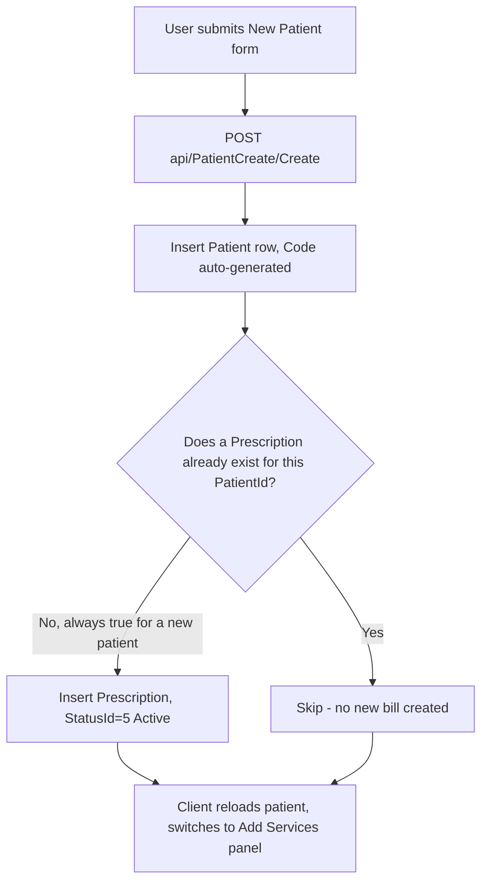
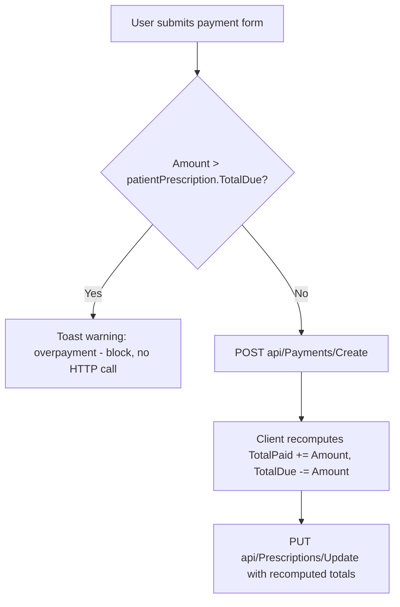
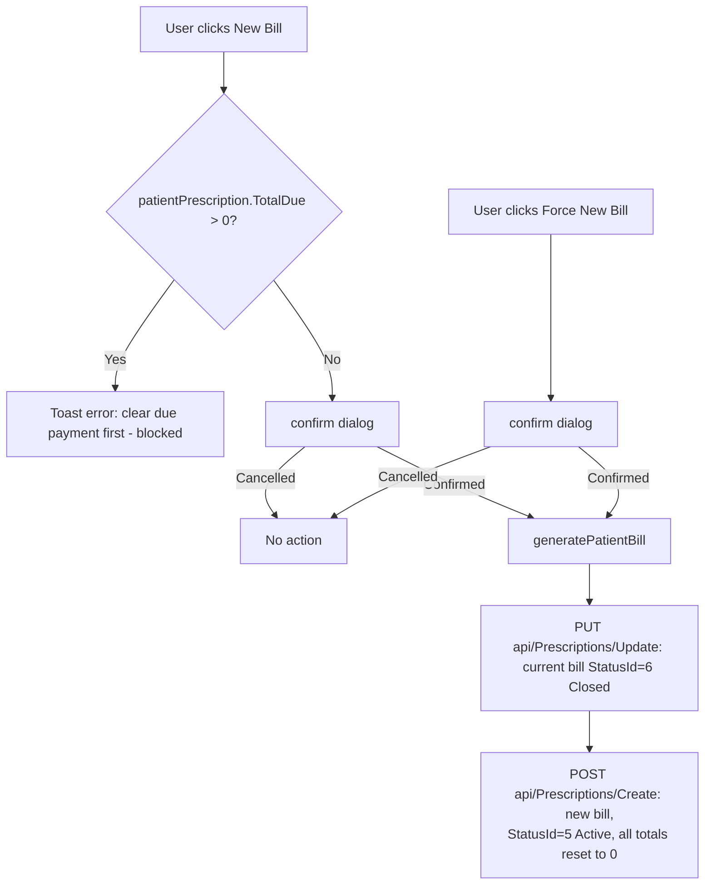
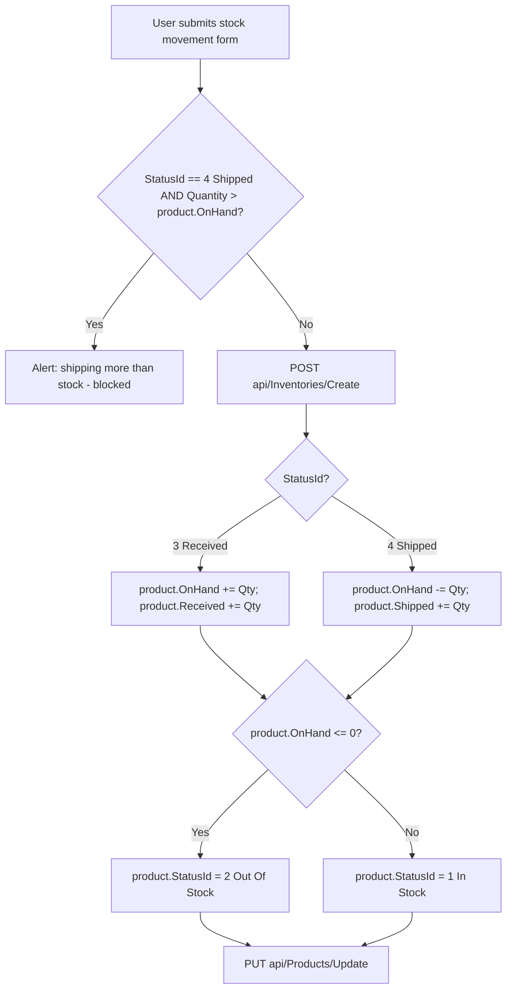
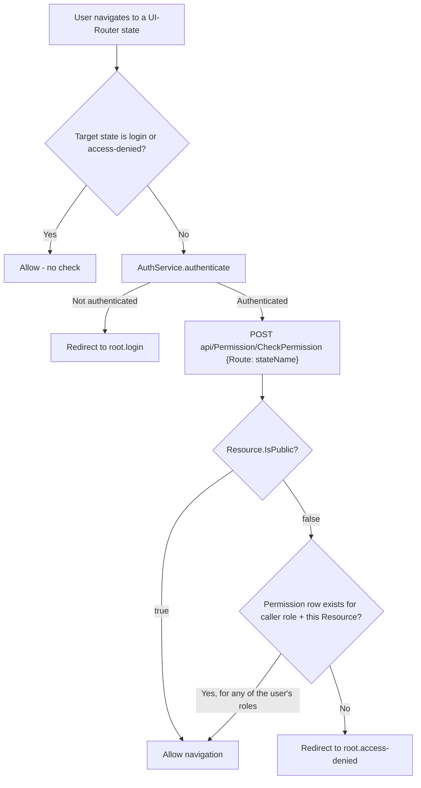

# Functional Spec: Dental Management System (DentalManagement.sln)

**Path analyzed:** C:\Learnings\Projects\legacy\dental-chamber\Source\App
**Date analyzed:** 2026-08-11

## Capabilities

All capabilities below are grounded in AngularJS controllers/templates under `Client/app/scripts/**` and `Client/app/views/**`, paired with the Web API controllers under `DM.Server/Controllers/*.cs` they call. The collector's `forms[]`/`xaml_forms[]`/`handler_implementations[]` arrays came back empty (this app is an AngularJS SPA, not the Delphi/WinForms shape those heuristics target), so every capability below was traced by direct `Read` of route configs, controllers, and templates rather than from collected facts.

### Patient & Billing

1. **View patient list** — grid of all patients with Code/Name/Phone/Age/Gender/LastVisitingDate/Payable/Paid/Due columns (`Client/app/scripts/patient/patient.controller.js`'s `loadPatientGridData()` → `GET api/Patients/GetGridList`; screen `root.patient` / `patient.tpl.html`).
2. **Search/filter patients** — by Code/Name/Phone text key, combined with a Due/Payment-Complete/All filter (`patient.controller.js`'s `search()` → `GET api/Patients/Search`).
3. **Register a new patient** — form fields: Name (text, capitalized on submit), Age (text), Gender (select dropdown, hardcoded options `Male/Female/Others`), Phone (text), Email (text), Address (textarea), Note (textarea) — `Client/app/views/patient/patient-create.tpl.html`, submitted via `PatientCreateController.addPatient()` → `POST api/PatientCreate/Create`. This single action also auto-opens the patient's first bill — see workflow **"New Patient Registration & Bill Auto-Provisioning."**
4. **Add treatment services to a patient's current bill** — checkbox list of catalog `MedicalService` rows (one checkbox per service), a numeric Quantity input per selected row, plus text inputs for Discount % and Fixed Discount — same `patient-create.tpl.html`, "Add Services" panel. This action triggers a two-call backend sequence — see workflow **"Add Treatment Services to Bill."**
5. **View/edit a patient's personal info** — Patient Id (disabled text), Name (text), Age (text), Gender (select), Phone (text), Email (text), Address (textarea), Note (textarea) — `patient-detail.tpl.html`'s "Patient" tab, `PatientDetailControlller.update()` → `PUT api/PatientCreate/Update`.
6. **Tag/untag a patient's medical conditions** — checkbox list bound to the catalog `MedicalInfo` list — `patient-detail.tpl.html`'s "Medical Condition" tab, `savePatientMedicalInfo()` → `POST api/MedicalInfo/SavePatientMedicalInfos`.
7. **Record a payment against the patient's current bill** — Date (`type="datetime"` text input), Amount (number input), Comment/"Paid for Service Taken" (single-row textarea) — `patient-detail.tpl.html`'s "Payment" tab. Triggers a two-call sequence — see workflow **"Record Payment Against Bill."**
8. **Delete a payment** — confirm dialog (`confirm(...)`) then removal; also reverses the bill's running totals — see workflow **"Delete Payment & Reverse Bill Totals."**
9. **View bill/service/payment history** — read-only table per past bill (Bill No, Created, charges, discounts, paid/due, status, service line items, payments) — `patient-detail.tpl.html`'s "History" tab, `GetPatientHistory()` → `GET api/Prescriptions/GetPatientHistory`.
10. **Close the current bill / open a new one** — "New Bill" and "Force New Bill" buttons — see workflow **"Close Bill / Open New Bill."**
11. **Print a payment receipt** — modal (`patientPaymentModal.html` inline template) rendering clinic letterhead, bill totals, and the single payment being printed, then `window.print()`.
12. **View a patient payments report by date range** — `patient-report.tpl.html` (not opened this run — see UI Inventory), `PatientReportController.loadPatientPaymentsReports()` → `GET api/PatientReports/GetPatientPaymentReport`, with its own print modal.

### Service & Medical-Info Catalog

13. **Manage the dental-service price catalog** (Create/Edit/Delete `MedicalService`) — Name (text, capitalized), Charge (text) — `patient-service.tpl.html` (not opened this run), `PatientServiceControlller` → `api/MedicalServices/{GetAll,Create,Update,Delete}`.
14. **Manage the medical-condition master list** (Create/Edit/Delete `MedicalInfo`) — Name (text, capitalized) — `patient-info.tpl.html` (not opened this run), `PatientInfoControlller` → `api/MedicalInfo/{GetAll,Create,Update,Delete}`.

### Inventory & Products

15. **Manage the product catalog** (Create/Update/Delete `Product`) — Code (text, uppercased), Name (text, capitalized), Starting Inventory (text), Minimum Required (text), Unit Price (text), Sale Price (text) — `Client/app/views/product/product.tpl.html`, `ProductController.js` → `api/Products/{Create,Update,Delete}`. A new product's `Received` and `OnHand` are both seeded from `StartingInventory` client-side before the POST.
16. **Search/browse products** — by Code/Name text key or In-Stock/Out-Of-Stock filter — `product.tpl.html` and `dashboard.tpl.html`, → `api/Products/{SearchProduct,Search,Filter,GetProductsIncludeStatus}`.
17. **Record a stock movement (receive or ship)** — Date (`type="datetime"`), Product (select dropdown, options from `GetProductsName`), Cash Memo No (text, uppercased), On Hand (disabled/read-only text), Received/Shipped Quantity (number), Stock Type (radio pair: Received=3 / Shipped=4) — `Client/app/views/stock/stock.tpl.html`. Triggers a two-call backend sequence — see workflow **"Record Stock Movement & Update Product Levels."**
18. **View stock-movement history for a product** — date-range (two `type="date"` inputs) and a preset days filter (Last 7/15/30 Days select), with running Received/Shipped totals and a print modal — `stock.tpl.html`, `getProductInventoryHistory()` → `GET api/Inventories/GetProductHistory`.
19. **View the inventory report** — per-product Received/Shipped/On-Hand across a date range, with a Product filter (select) and Status filter (select: All/In Stock/Out Of Stock) — `stock-report.tpl.html` (not opened this run), `StockReportController` → `GET api/InventoryReports/GetReport`, with its own print modal.

### Appointments & Doctors

20. **Schedule/manage appointments** — Patient Name/Id (free text, capitalized), Age (number), Phone (text), Date (`uib-datepicker-popup` date-picker with min/max bounds and a calendar-icon trigger button), Time (`uib-timepicker` hour/minute stepper with AM/PM toggle) — `Client/app/views/patient/patient-appointment.tpl.html`, `PatientAppointmentController.save()` → `POST api/Appointments/Create`. The Doctor for the appointment is **not** an exposed form field — see Named Gaps.
21. **Mark an appointment as visited** — confirm dialog then `PUT api/Appointments/Update` setting `StatusId = 8`.
22. **Search/filter appointments** — by date (defaults to today) or a free-text key against Code/PatientNameOrId.
23. **Print an appointment copy** — modal (`patientAppointmentModal.html` inline template) + `window.print()`.
24. **View the doctor list** — read-only; no create/update/delete UI or endpoint exists (`DoctorController` exposes only `GetAll`/`GetById`).

### Identity, Roles & Permissions

25. **Log in** — Username (text) / Password (password) — `Client/app/views/auth/login.tpl.html` (not opened this run), `LoginController.login()`. See workflow **"Login & Post-Auth Routing."**
26. **Log out** — clears local token/user/role storage and returns to the login screen (`AppControlller.logout()` / `ProfileController`'s own `logout()`).
27. **View/update own profile** — First Name, Last Name, Email, Phone (all text) — `profile.tpl.html` (not opened this run), `ProfileController.updateProfile()` → `POST api/Profile/UpdateProfile`.
28. **Change own password** — Current Password, New Password, Retype Password (all password inputs, inferred from the request model's field names — the template itself was not opened) → `POST api/Profile/UpdatePassword`; enforces DR-013. Forces a logout on success.
29. **Manage users** (Create/Update/Delete `ApplicationUser`) — First/Last Name, Email, Phone, Username (all text), Role (select, options from `api/Role`), a "Change Password" checkbox that reveals New Password / Retype Password (password inputs) only when checked — `Client/app/views/user/user.tpl.html`, `UserController.js` → `api/User/{CreateUser,UpdateUser,DeleteUser}`. Enforces DR-011 (no self-delete) and DR-012 (password confirmation match).
30. **Manage roles** (Create/Update/Delete `IdentityRole`) — Name (text) — `role.tpl.html` (not opened this run), `RoleController.js` (Angular) → `api/Role`.
31. **Manage the resource/screen catalog** (Create/Update/Delete `SecurityModels.Resource`) — Name (text), Route (text), Public (radio pair Yes/No) — `Client/app/views/auth/resource.tpl.html`, `ResourceController.js` (Angular) → `api/Resource`. The Public radio group binds both a plain `value` attribute and an Angular `ng-value` to the same `ng-model` — see Named Gaps.
32. **Grant/revoke role permissions** — select a Role from a read-only list, then check/uncheck individual Resources (checkbox list wired via the `checklist-model` directive) or use "Check All"/"Uncheck All", then Save — `Client/app/views/auth/permission.tpl.html`, `PermissionController.js` (Angular) → `POST api/Permission/AddList`, which fully replaces that role's permission set (`AddPermissions` seed pattern mirrored at runtime by `PermissionController.CheckPermission` reads).
33. **Screen-level access gate on every navigation** — not a user-initiated action but a capability the system enforces on all 32 above: every AngularJS state transition is checked before it renders — see workflow **"Screen Access Authorization Check."**

### Static/Informational

34. **View the About page** — `about.tpl.html` (not opened this run); its controller (`about.controller.js`) is an empty placeholder (`// code goes here`) — see Named Gaps.
35. **View the Contact page** — `contact.tpl.html` (not opened this run); `app.config.js` registers its controller as `"ContactController"`, but no matching `contact.controller.js`/script defining that controller was found anywhere under `Client/app/scripts/` in this run — see Named Gaps.
36. **Dashboard** — product search/filter (mirrors capability 16) plus quick-navigation buttons to Inventory, Product, Report, and Patient screens — `dashboard.tpl.html`, `DashboardController.js`.

## Workflows

### New Patient Registration & Bill Auto-Provisioning

Single user action (submitting the "New Patient" form) causes the server to perform two EF writes in one HTTP request:

1. `PatientCreateController.Post` (`POST api/PatientCreate/Create`) inserts the new `Patient` row, with `Code` computed server-side (DR-001).
2. If no `Prescription` yet exists for that `PatientId` (always true for a brand-new patient), the same request inserts a `Prescription` with `StatusId = 5` ("Active") and a server-computed `Code` (DR-003).



Both writes happen inside one HTTP call with **no database transaction** wrapping them (`DM.Service/BaseService.cs`'s generic `Add` only commits once per call; `PatientCreateController.Post` calls `_patientCreateService.Add(patient)` and, separately, `_prescriptionService.Add(prescription)`). If the second insert fails after the first succeeds, the patient exists with zero bills — every downstream screen that calls `GetPatientCurrentPrescription(...).Last()` (e.g. `PatientController.Get()`/`Search()`, per `pending-questions.md` PQ-001) would then throw on that patient. This workflow is the concrete mechanism that (if it always runs) would make PQ-001's "every patient has ≥1 prescription" invariant true — I did not verify it is transactionally guaranteed.

### Add Treatment Services to Bill

Single "Save" click on the Add-Services panel (`patient-create.tpl.html`) triggers two sequential calls from `patient-create.controller.js`'s `savePatientMedicalService()`:

1. `POST api/PatientMedicalServices/CreateList` — submits the full list of selected `PatientMedicalService` line items for the current `PrescriptionId` (replaces the prior list per DR-018).
2. On success, `updatePrescription()` fires `PUT api/Prescriptions/Update` — pushes the client-computed `TotalCharge`, `DiscountPercent`, `DiscountAmount`, `FixedDiscount`, `TotalPayable`, `TotalDue` onto the `Prescription` row.

If step 2 is omitted (or fails silently), the bill's stored totals (`TotalCharge`/`TotalPayable`/`TotalDue`) never reflect the services just added — the patient grid (`PatientController.GetGridList`) and every other screen that reads `Prescription.TotalDue` directly would keep showing stale figures even though the line items themselves (step 1) were saved correctly.

### Record Payment Against Bill



`patient-detail.controller.js`'s `savePayment()`: the overpayment guard (DR-005) is purely client-side and runs before any HTTP call. If the second call (`updatePatientPrescription`) is skipped, the `Payment` row is persisted but the `Prescription.TotalPaid`/`TotalDue` snapshot silently diverges from the true sum of its `Payments` — nothing recomputes those fields from the `Payments` collection server-side.

### Delete Payment & Reverse Bill Totals

`deletePayment(id)`: after a `confirm()` dialog, `DELETE api/Payments/Delete` removes the payment, then the client subtracts that payment's `Amount` back out of `patientPrescription.TotalPaid`/adds it back into `TotalDue`, and issues `PUT api/Prescriptions/Update` to persist the reversal. Same "totals silently diverge if the second call is skipped" risk as the payment-creation workflow above.

### Close Bill / Open New Bill



`patient-detail.controller.js`'s `generatePatientBill()` is the shared implementation behind both "New Bill" (guarded by DR-006) and "Force New Bill" (bypasses the guard). The second call hardcodes `StatusId: 5` and zeroes every monetary field on the brand-new `Prescription`. If the second call is omitted, the patient is left with **no active bill at all** — every subsequent "current prescription" lookup (`GetPatientCurrentPrescription(...).LastOrDefault(x => x.StatusId == 5)`) returns nothing, and the "Add Services"/"Payment" panels would have no bill to attach to.

### Record Stock Movement & Update Product Levels



`stock.controller.js`'s `save()` → `updateProduct()`. The over-shipment guard (DR-008) is client-side only. If the second call (`updateProduct`) is omitted, the `Inventory` movement row is persisted but the parent `Product.OnHand`/`Received`/`Shipped`/`StatusId` never change — the product would keep reporting its pre-movement stock level and status (e.g. still "In Stock" after being fully shipped out) everywhere else in the app (dashboard, inventory report, product list) even though the movement itself was recorded.

### Screen Access Authorization Check



Runs on **every** navigation in the SPA (`Client/app/scripts/app.config.js`'s `$rootScope.$on("$stateChangeStart", ...)` → `AuthService.authorize` → `DM.Server/Service/PermissionService.cs`'s `CheckPermission`). This is the single mechanism enforcing DR-015/DR-016 client-side; nothing analogous was found gating the underlying Web API controllers themselves beyond the generic `[Authorize]`/`[Authorize(Roles=...)]` attributes — see Named Gaps.

### Login & Post-Auth Routing

```mermaid
flowchart TD
    A[User submits Username/Password] --> B[POST token, grant_type=password]
    B -->|Failure| C[Toast: failed to sign in; route to root.login]
    B -->|Success| D[Store bearer token, 13-day expiry]
    D --> E[GET api/Profile/UserProfile]
    E -->|Failure| C
    E -->|Success| F[Store user info + role names]
    F --> G{user.RoleNames[0]}
    G -->|SystemAdmin, Inventory, Admin, or Manager| H[Route to root.patient]
    G -->|Doctor, Compounder, or Patient| H
    G -->|anything else / no roles| I[Logout, route to root.login]
```

`LoginController.login()` → `AuthService.authenticate()` (OAuth resource-owner-password grant against `/token`) → `AuthService.userProfile()` → `AppService.nextRoute()`. Every one of the seven seeded roles currently routes to the same `root.patient` landing screen regardless of role — there is no role-differentiated landing page despite the branch existing in code (Named Gap).

## UI Inventory

Every entry below is a UI-Router state registered in one of `Client/app/scripts/**/*.config.js`, its template, and its controller. None of these were found via the collector's `forms[]`/`xaml_forms[]`/`other_ui_files[]` (all empty for this stack) — every row was found and parse-status-tracked by my own `Read`/`Glob` this run.

| Screen (state) | Template | Controller | Parse status | Notes / non-text controls |
|---|---|---|---|---|
| `root.dashboard` | `dashboard.tpl.html` | `DashboardController` | Fully opened (both) | select (status filter); `ng-grid` (deprecated ngGrid directive) |
| `root.patient` | `patient.tpl.html` | `PatientController` | Controller opened; template **not opened this run** — grid columns confirmed via `columnDefs` in the controller only | select (filter dropdown, per controller) |
| `root.patient-create` | `patient-create.tpl.html` | `PatientCreateController` | Fully opened (both) | select (Gender), textarea×2, checkbox list (service selection), number (Quantity) |
| `root.patient-detail` | `patient-detail.tpl.html` | `PatientDetailControlller` (sic — three "l"s, confirmed in source) | Fully opened (both) | select (Gender), textarea×2, checkbox list (medical conditions), datetime text (payment date), number (Amount) |
| `root.patient-info` | `patient-info.tpl.html` | `PatientInfoControlller` | Controller opened; template not opened this run | none confirmed (controller implies plain text form) |
| `root.patient-service` | `patient-service.tpl.html` | `PatientServiceControlller` | Controller opened; template not opened this run | none confirmed |
| `root.patient-report` | `patient-report.tpl.html` | `PatientReportController` | Controller opened; template not opened this run | date filter fields (per controller's `$scope.filter`) |
| `root.patient-appointment` | `patient-appointment.tpl.html` | `PatientAppointmentController` | Fully opened (both) | date-picker (`uib-datepicker-popup`), time-picker (`uib-timepicker`), number (Age), plain `type="date"` filter input |
| `root.product` | `product.tpl.html` | `ProductController` | Fully opened (both) | none — all fields are plain text inputs despite several being numeric |
| `root.stock` | `stock.tpl.html` | `StockController` | Fully opened (both) | datetime text, select (Product), disabled text (On Hand), number (quantity), radio pair (Stock Type) |
| `root.stock-report` | `stock-report.tpl.html` | `StockReportController` | Controller opened; template not opened this run | select×2 (Product, Status), per controller |
| `root.user` | `user.tpl.html` | `UserController` | Fully opened (both) | select (Role), checkbox ("Change Password" toggle), password×2 (conditionally shown) |
| `root.role` | `role.tpl.html` | `RoleController` (Angular) | Controller opened; template not opened this run | none confirmed |
| `root.resource` | `resource.tpl.html` | `ResourceController` (Angular) | Fully opened (both) | radio pair (Public Yes/No) — see Named Gaps for a binding ambiguity |
| `root.permission` | `permission.tpl.html` | `PermissionController` (Angular) | Fully opened (both) | checkbox list via `checklist-model` directive |
| `root.login` | `login.tpl.html` | `LoginController` | Controller opened; template not opened this run | password field (inferred from `$scope.credentials.Password`) |
| `root.access-denied` | `access-denied.tpl.html` | `AccessDeniedController` | Controller opened; template not opened this run | none — logic-only redirect controller |
| `root.profile` | `profile.tpl.html` | `ProfileController` | Controller opened; template not opened this run | password×3 (inferred from `ChangePasswordRequestModel` fields) |
| `root.about` | `about.tpl.html` | `AboutController` | Controller file exists but is an **empty placeholder** (`about.controller.js`: `// code goes here`); template not opened | — |
| `root.contact` | `contact.tpl.html` | `ContactController` | **Neither found** — `app.config.js` names this controller but no `contact.controller.js`/equivalent script exists under `Client/app/scripts/` in this run | Named Gap |
| — (inline, not a routed state) | `patient-report-2.tpl.html` | none found | File exists on disk (`Client/app/views/patient/`) but is **not referenced by any `.config.js` route** I opened — orphaned/unused template, not opened this run | Named Gap |
| — (shared layout) | `nav.html` | `AppControlller` | Fully opened | role-gated menu items (`ng-show="isAdminUser \|\| isSystemAdminUser"`) |
| — (shared layout) | `footer.html` | none (static) | Not opened this run | — |
| — (shared modal) | `confirm.modal.tpl.html` | `ConfirmModalInstanceController` | Controller opened; template not opened this run | generic OK/Cancel confirm dialog reused by Role/User delete flows |
| — (app shell) | `index-dev.html` / `index-prod.html` | n/a | Not opened this run — referenced only via `architecture.md`'s prior finding that `index-dev.html` bootstraps `ng-app="dentalApp"` | — |
| — (inline `<script type="text/ng-template">` blocks, embedded in host screens, not separate files) | `patientPaymentModal.html`, `patientAppointmentModal.html`, `patientReportModal.html`, `inventoryHistoryReportModal.html`, `inventoryReportModal.html` | per-modal instance controllers (all opened, embedded in their host `.controller.js` file) | Fully opened (embedded in patient-detail/patient-appointment/patient-report/stock/stock-report controllers respectively) | print-preview layouts; no additional input controls beyond what's listed under their host screen |

No file-upload, image-upload, or other binary-capture control was found anywhere in this UI — every entity in `domain-model.md` is scalar/text/numeric, so the Field Semantics & Capture-Widget Rule's blob-handling guidance has no applicable findings in this codebase.

## Named Gaps

1. **Doctor selection is not exposed in the Appointment UI.** `Appointment.DoctorId` is a required FK, but `patient-appointment.controller.js`'s `init()` hardcodes `DoctorId: "9b6ba3ad-c9be-e511-9bf4-402cf40f4b2f"` — the exact GUID of the single doctor seeded by `DM.Models/Migrations/Configuration.cs`'s `AddDoctor()`. There is no doctor picker anywhere in the appointment form, and `DoctorController` exposes no create/update/delete endpoint. Whether multi-doctor support is a planned-but-unbuilt feature or intentionally out of scope was not answered by any code path I opened.
2. **Several client-side-only business rules have no server-side mirror**: discount-percent range (DR-004), payment-not-exceeding-due (DR-005), bill-close-blocked-while-due (DR-006, though "Force" exists as an intentional override), and shipment-not-exceeding-on-hand (DR-008) are all enforced only in AngularJS controllers. A rebuild that faithfully reimplements the Web API controllers but omits the equivalent Angular logic would silently accept data the legacy app blocks.
3. **`PatientMedicalServiceRepository.AddList`'s replace-loop (DR-018)** deletes the prior service list keyed off only the *first* submitted item's `PrescriptionId` (the loop `break`s immediately) — correct only because its single caller always submits a single-`PrescriptionId` batch; nothing enforces that invariant if a future caller submits a mixed batch.
4. **`DashboardController.js`'s `$scope.detail` function is confirmed dead code.** It references UI-Router states `"payslip.approved"`/`"payslip.detail"` that do not exist anywhere in this app's routing configuration. I opened `dashboard.tpl.html` directly and confirmed its active `columnDefs` never wire a `cellTemplate` to call `detail(...)` — the one column that did (`Id`, with `ng-click="detail(row.entity)"`) is commented out. This function is unreachable from the UI as currently wired; it is very likely a copy-paste remnant from an unrelated project.
5. **`root.contact`'s controller, `ContactController`, was not found anywhere under `Client/app/scripts/`** in this run — `app.config.js` names it but no `.controller.js` (or any other script) defines it. Either the file lives outside the scanned tree, was deleted without updating the route, or this route is currently broken.
6. **`about.controller.js` is an empty placeholder** (`// code goes here`) — the About screen has no confirmed behavior beyond whatever static markup `about.tpl.html` contains (not opened this run).
7. **`patient-report-2.tpl.html` exists on disk but is not referenced by any route config I opened** — likely an abandoned alternate version of the patient-report screen; not included in the Capabilities section above since no controller/route wires it up.
8. **`resource.tpl.html`'s "Public" radio group binds both a plain `value` attribute (`"0"`/`"1"`) and an Angular `ng-value` (`isPublicEnum.False`/`isPublicEnum.True`) to the same `ng-model="model.IsPublic"`.** The widget itself (a radio-button pair) is unambiguous, but which binding actually determines the persisted boolean was not fully verified from static markup alone.
9. **Two seed user accounts ship with a shared, hardcoded password `"123qwe"`** (`DM.Server/Migrations/Configuration.cs`'s `AddUsers()`, users `superadmin`/`admin`). If this seed data reaches a real deployment un-rotated, it is a default-credential exposure; no code path I saw forces a password change on first login.
10. **No automated test exists for any capability or workflow above** — `DM.Server.Tests/UnitTest1.cs` is a single empty `[TestMethod]` stub (confirmed in `codebase-report.md` and re-confirmed by the collector's `test_locations` coming back empty for a project that does exist on disk). None of the DR-### rules or workflows documented here are protected by an executable specification today.
11. **`LoginController`'s post-auth routing branches on seven distinct roles** (`AppService.nextRoute()`) but **every branch currently routes to the same `root.patient` screen** — there is no role-differentiated landing experience despite the branching logic existing, and no seeded account exercises the `Manager`/`User`/`Patient`/`Doctor`/`Compounder` branches (only `SystemAdmin` and `Admin` have seed users). Whether role-specific landing pages were planned-but-unbuilt is not answered by any code path opened.
12. **Fourteen templates were not opened this run** (`patient.tpl.html`, `patient-info.tpl.html`, `patient-service.tpl.html`, `patient-report.tpl.html`, `patient-report-2.tpl.html`, `stock-report.tpl.html`, `role.tpl.html`, `login.tpl.html`, `access-denied.tpl.html`, `profile.tpl.html`, `about.tpl.html`, `contact.tpl.html`, `footer.html`, `confirm.modal.tpl.html`) — their entries in UI Inventory above rely on route config plus controller/service code only; any capture-widget claim for a *field* on those specific screens beyond what the controller code itself reveals should be treated as unconfirmed, not assumed to be a plain text input.
13. **No server-side authorization check tied to the `Resource`/`Permission` model was found on the domain Web API controllers themselves** — `PatientController`, `ProductController`, etc. carry only the generic `[Authorize]` attribute (any authenticated user, any role), while the fine-grained per-route Permission check (DR-015) is enforced exclusively client-side in `app.config.js`'s `$stateChangeStart` hook. A user who could reach the API directly (bypassing the SPA) would not be blocked by DR-015/DR-016 at all — I did not find a `[PermissionFilter]`-style attribute or equivalent on any domain controller.
