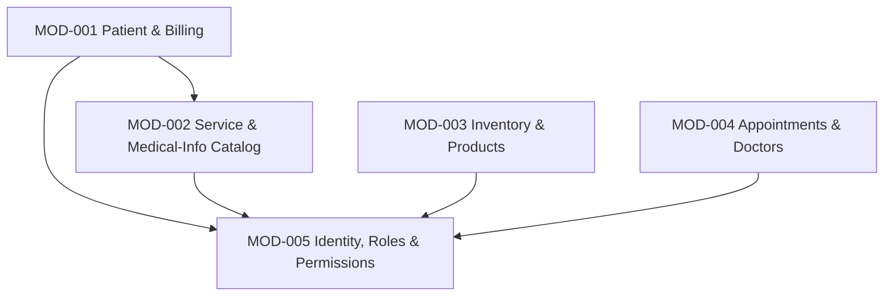

# Module Map: Dental Management System (DentalManagement.sln)

**Path analyzed:** C:\Learnings\Projects\legacy\dental-chamber\Source\App
**Date analyzed:** 2026-08-11
**Status:** CONFIRMED by Pasan Gunathilaka, 2026-08-12

This is a first-ever generation of this document. The collected JSON's `module_map.prior_modules[]` roster is empty and `next_mod_id` is `MOD-001`, so every module below is newly minted starting at `MOD-001` — there is nothing to reconcile against. `architecture.md`'s own dependency diagrams only document *technical* layering (`Controller → Service → Repository → Models`, uniform across every module), not business-module-level dependency direction — so every `**Depends on:**` claim below is derived from my own reading of controller/service constructor injections during this run, cited per-module, not from `architecture.md`.

No entity, rule, service, or screen found during this run was contested between two plausible module owners (trigger T3 never fired), so no module or placement below carries a `⚠ PROVISIONAL` marker and no new pending question was raised for module grouping.

## Modules

### MOD-001 — Patient & Billing

- **Purpose:** Register patients, run their per-visit bill ("Prescription"), add billed treatment line items, record/reverse payments against the bill, and open/close bills.
- **Owns (entities):** Patient, Prescription, PatientMedicalService, Payment
- **References (not owned):** MedicalService (MOD-002), MedicalInfo (MOD-002, via PatientMedicalInfo), Status (Unassigned — shared lookup table)
- **Services/routes:** `PatientController`, `PatientCreateController`, `PatientDetailController`, `PatientMedicalServiceController`, `PatientReportController`, `PaymentController`, `PrescriptionController` (`DM.Server/Controllers/*.cs`); `DM.Service/PatientCreateService.cs`, `PrescriptionService.cs`, `PaymentService.cs`, `PatientMedicalServiceService.cs`; `DM.Repository/PatientCreateRepository.cs`, `PrescriptionRepository.cs`, `PaymentRepository.cs`, `PatientMedicalServiceRepository.cs`
- **Screens:** Patient List (`root.patient`), New Patient / Add Services (`root.patient-create`), Patient Detail — Services/Medical/Payment/History/Patient tabs (`root.patient-detail`), Patient Payment Report (`root.patient-report`)
- **Business rules:** DR-001, DR-002, DR-003, DR-004, DR-005, DR-006, DR-007, DR-018
- **Depends on:** MOD-002 (reads/writes `MedicalService`/`MedicalInfo`/`PatientMedicalInfo` directly — see Cross-Module References); MOD-005 (every controller in this module carries `[Authorize]`, and every screen it exposes is gated by the client-side permission check in `app.config.js`'s `$stateChangeStart` before it renders — e.g. `DM.Server/Controllers/PatientController.cs`'s `[Authorize]` attribute)
- **Backlog items:** not yet backlog-linked — `rebuild-backlog.md` does not exist yet
- **Evidence:**
  - `DM.Models/Patient.cs`, `Prescription.cs`, `PatientMedicalService.cs`, `Payment.cs` — all four entities' fields opened directly, no cross-references outside this list except `MedicalServiceId`/`MedicalInfoId` FKs and `StatusId`.
  - `DM.Server/Controllers/PatientDetailController.cs` constructor injects `IMedicalServiceService` directly (reads MOD-002's catalog to display billed line items) — the concrete evidence for the MOD-002 dependency.
  - `Client/app/scripts/patient/patient-detail.controller.js`'s `getMedicalInfos`/`savePatientMedicalInfo` call `api/MedicalInfo/*` (MOD-002's controller) from within this module's own screen — the Medical Condition tab is served by MOD-002's backend from inside a MOD-001 screen.
  - `domain-model.md`'s Business Rules DR-001 through DR-007 and DR-018 all cite files exclusively under `DM.Server/Controllers/Patient*`, `Prescription*`, `Payment*` and `Client/app/scripts/patient/*` — no file outside this module's own list is cited by those rules.

### MOD-002 — Service & Medical-Info Catalog

- **Purpose:** Maintain the two master lists the Patient & Billing module bills/tags against — priced dental services, and medical conditions/allergies.
- **Owns (entities):** MedicalService, MedicalInfo, PatientMedicalInfo
- **References (not owned):** Patient (MOD-001) — `PatientMedicalInfo.PatientId` and `MedicalInfoController.GetPatientMedicalInfos(patientId)` read a MOD-001-owned key, but this module owns the join row itself.
- **Services/routes:** `MedicalServiceController`, `MedicalInfoController` (`DM.Server/Controllers/*.cs`); `DM.Service/MedicalServiceService.cs`, `MedicalInfoService.cs`; `DM.Repository/MedicalServiceRepository.cs`, `MedicalInfoRepository.cs`, `PatientMedicalInfoRepository.cs`
- **Screens:** Manage Dental Services (`root.patient-service`), Manage Medical Conditions (`root.patient-info`)
- **Business rules:** DR-017, DR-019
- **Depends on:** MOD-005 (`[Authorize]` on both controllers, and both screens pass through the client-side permission gate)
- **Backlog items:** not yet backlog-linked — `rebuild-backlog.md` does not exist yet
- **Evidence:**
  - `DM.Models/MedicalService.cs`, `MedicalInfo.cs`, `PatientMedicalInfo.cs` opened directly; neither `MedicalService` nor `MedicalInfo` carries any FK into MOD-001's entities.
  - `DM.Server/Controllers/MedicalInfoController.cs`'s `GetPatientMedicalInfos`/`SavePatientMedicalInfos` are the only two endpoints in this module that take a `patientId`/`PatientId` — confirming the one reference direction (this module is read/written *by* MOD-001's screen, it does not itself read Patient data beyond the bare id).
  - `domain-model.md` DR-017 (uniqueness) and DR-019 (`Convert.ToInt32(Charge)` truncation) both cite only `DM.Models/MedicalService.cs`/`MedicalInfo.cs`.

### MOD-003 — Inventory & Products

- **Purpose:** Maintain the product catalog, record stock-in/stock-out movements, and report on-hand/received/shipped quantities over time.
- **Owns (entities):** Product, Inventory
- **References (not owned):** Status (Unassigned — shared lookup table)
- **Services/routes:** `ProductController`, `InventoryController`, `InventoryReportController` (`DM.Server/Controllers/*.cs`); `DM.Service/ProductService.cs`, `InventoryService.cs`; `DM.Repository/ProductRepository.cs`, `InventoryRepository.cs`
- **Screens:** Product Catalog (`root.product`), Stock Movement / History (`root.stock`), Stock Report (`root.stock-report`), Dashboard (`root.dashboard` — a product-search/filter aggregator screen with quick-nav tiles; owns no entity of its own, placed here because every data call it makes is to this module's `ProductController`)
- **Business rules:** DR-008, DR-009, DR-020
- **Depends on:** MOD-005 (`[Authorize]` on all three controllers, and all four screens pass through the client-side permission gate)
- **Backlog items:** not yet backlog-linked — `rebuild-backlog.md` does not exist yet
- **Evidence:**
  - `DM.Models/Product.cs`, `Inventory.cs` opened directly; `Product.Inventories` is the only navigation property, and it stays entirely inside this pair.
  - `Client/app/scripts/dashboard/dashboard.controller.js` calls only `urlService.ProductUrl + "/GetProductsIncludeStatus"` / `"/Filter"` / `"/Search"` — all three are `ProductController` endpoints, confirming the Dashboard screen's placement here.
  - `domain-model.md` DR-008, DR-009, DR-020 all cite only `Client/app/scripts/stock/stock.controller.js` and `DM.Server/Controllers/InventoryReportController.cs`.
  - No file in this module's controller/service/repository list imports or references `DM.Models/Patient.cs`, `Prescription.cs`, `Appointment.cs`, or the Identity models — confirmed by reading every file listed above; this module has no dependency on MOD-001, MOD-002, or MOD-004.

### MOD-004 — Appointments & Doctors

- **Purpose:** Schedule and track appointment slots for a (currently single-seeded) doctor, independent of patient registration.
- **Owns (entities):** Doctor, Appointment
- **References (not owned):** Status (Unassigned — shared lookup table)
- **Services/routes:** `DoctorController`, `AppointmentController` (`DM.Server/Controllers/*.cs`); `DM.Service/DoctorService.cs`, `AppointmentService.cs`; `DM.Repository/DoctorRepository.cs`, `AppointmentRepository.cs`
- **Screens:** Appointments (`root.patient-appointment`)
- **Business rules:** DR-010
- **Depends on:** MOD-005 (`[Authorize]` on both controllers, and its one screen passes through the client-side permission gate)
- **Backlog items:** not yet backlog-linked — `rebuild-backlog.md` does not exist yet
- **Evidence:**
  - `DM.Models/Appointment.cs` opened directly — `PatientNameOrId` is a plain `string`, confirmed not a `Guid` FK to `Patient`; `DoctorId` is the module's only outward FK, and it stays inside this module (→ `Doctor`).
  - `DM.Models/Doctor.cs`'s only navigation property is `Appointments`, confirmed to stay entirely inside this module.
  - `Client/app/scripts/patient/patient-appointment.controller.js` calls only `urlService.AppointmentUrl + "/*"` — no call to any MOD-001/002/003 endpoint anywhere in this file.
  - This module's route is nested under the AngularJS `patient/*` URL prefix and its script lives in the `Client/app/scripts/patient/` folder alongside MOD-001's files — a directory-name coincidence I am explicitly **not** treating as grouping evidence, per the Module Grouping Rule; the actual boundary above rests on the FK/service-call evidence cited, not the folder layout.

### MOD-005 — Identity, Roles & Permissions

- **Purpose:** Authenticate clinic staff, manage user accounts and roles, catalog the SPA's protected screens as `Resource` rows, and gate every screen/route behind a role→resource `Permission` grant.
- **Owns (entities):** ApplicationUser, IdentityRole, Resource, Permission
- **References (not owned):** None
- **Services/routes:** `AccountController`, `UserController`, `RoleController`, `ResourceController`, `PermissionController`, `ProfileController` (`DM.Server/Controllers/*.cs`, namespace `DM.AuthServer.Controllers`); `DM.AuthServer.Service/UserService.cs`, `RoleService.cs`, `ResourceService.cs`, `PermissionService.cs`, `ProfileService.cs`; `DM.AuthServer.Repository/UserRepository.cs`, `RoleRepository.cs`, `ResourceRepository.cs`, `PermissionRepository.cs`, `ProfileRepository.cs`
- **Screens:** Login (`root.login`), Access Denied (`root.access-denied`), Profile (`root.profile`), Manage Users (`root.user`), Manage Roles (`root.role`), Manage Resources (`root.resource`), Manage Permissions (`root.permission`)
- **Business rules:** DR-011, DR-012, DR-013, DR-014, DR-015, DR-016
- **Depends on:** None. This module owns the authorization gate every other module depends on; nothing in its own controllers/services references `Patient`/`Product`/`Appointment`/`MedicalService` data.
- **Backlog items:** not yet backlog-linked — `rebuild-backlog.md` does not exist yet
- **Evidence:**
  - `DM.Server/Models/ApplicationDbContext.cs`, `SecurityModels.cs`, `IdentityModels.cs` — all four owned entities opened directly; none carries a FK into the domain schema (`DentalDbContext`).
  - `DM.Server/Migrations/Configuration.cs`'s `AddResources()` seeds a `Resource.Route` row for every other module's UI-Router state name (e.g. `"root.patient"`, `"root.product"`, `"root.stock"`, `"root.patient-appointment"`) as plain string **data**, not a code-level reference — this is why the relationship is one-directional (MOD-005 *names* the other modules' screens; the other modules never reference `Resource`/`Permission` back) and is recorded as a Cross-Module Reference below rather than a `**Depends on:**` edge in either direction.
  - `Client/app/scripts/app.config.js`'s `$stateChangeStart` hook calls `AuthService.authorize` (→ `PermissionController.CheckPermission`) before every single state transition in the app, for every module — the concrete evidence that MOD-001 through MOD-004 all depend on this module, not the reverse.

## Cross-Module References

| Entity | Owner | Referenced by | Evidence |
|---|---|---|---|
| MedicalService | MOD-002 | MOD-001 | `PatientMedicalService.MedicalServiceId` FK (`DM.Models/PatientMedicalService.cs`); `DM.Server/Controllers/PatientDetailController.cs` injects `IMedicalServiceService` |
| MedicalInfo / PatientMedicalInfo | MOD-002 | MOD-001 | `Client/app/scripts/patient/patient-detail.controller.js`'s `getMedicalInfos`/`savePatientMedicalInfo` call `api/MedicalInfo/GetPatientMedicalInfos` and `.../SavePatientMedicalInfos` from the Patient Detail screen |
| Status | Unassigned (shared lookup, no module owner) | MOD-001 (`Prescription.StatusId`), MOD-003 (`Product.StatusId`, `Inventory.StatusId`), MOD-004 (`Appointment.StatusId`) | `[ForeignKey("StatusId")]` on `Prescription.cs`, `Product.cs`, `Inventory.cs`, `Appointment.cs`; seed values in `DM.Models/Migrations/Configuration.cs`'s `AddStatus()` |
| Resource / Permission (route-name data only, not a code reference) | MOD-005 | Named by (not referenced by code from) MOD-001–MOD-004 | `DM.Server/Migrations/Configuration.cs`'s `AddResources()` seed list — see MOD-005's own Evidence above; listed here for completeness since it is the one place another module's identity ("Patient", "Product", "Stock", "Patient Appointment", …) appears as data inside MOD-005 |

## Module Dependencies

MOD-005 (Identity, Roles & Permissions) sits at the bottom of every dependency chain: all four other modules require its authorization gate before any of their screens render, and none of the four ever calls into `AccountController`/`UserController`/`RoleController`/`ResourceController`/`PermissionController` for domain purposes — only for the shared `$stateChangeStart` permission check. MOD-001 (Patient & Billing) is the only module with a second outgoing edge, into MOD-002 (Service & Medical-Info Catalog), because its Patient Detail screen reads and writes MOD-002's `MedicalService`/`MedicalInfo` catalogs directly. MOD-003 (Inventory & Products) and MOD-004 (Appointments & Doctors) are otherwise fully independent of MOD-001 and MOD-002 and of each other — confirmed by reading every controller/service/repository file each module owns and finding no import of, or FK into, another module's entities beyond what is listed above.

This ordering is derived entirely from my own reading of constructor injections, `$http` call targets, and FK declarations during this run — `architecture.md` does not document business-module dependency direction (only the uniform technical layering `Controller → Service → Repository → Models`), so no claim above is attributed to that document.

## Unassigned

- **`Status` (entity)** — a single shared lookup table reused with different meanings by `Prescription` (MOD-001), `Product`/`Inventory` (MOD-003), and `Appointment` (MOD-004). It has no dedicated controller/service/screen of its own (no code path creates, updates, or deletes a `Status` row outside the one-time migration seed) and no business rule of its own beyond the four modules' own rules about which numeric `StatusId` values they use — genuinely cross-cutting infrastructure, not a migration/acceptance unit in its own right.
- **`root.about` screen** — its controller (`about.controller.js`) is an empty placeholder; no confirmed capability or entity ownership. See `functional-spec.md` Named Gaps #6.
- **`root.contact` screen** — `app.config.js` names a `ContactController` that was not found anywhere under `Client/app/scripts/` in this run; status of this route is unconfirmed. See `functional-spec.md` Named Gaps #5.
- **`patient-report-2.tpl.html`** — exists on disk but is not wired to any route config opened during this run; likely an abandoned duplicate of MOD-001's Patient Payment Report screen. See `functional-spec.md` Named Gaps #7.
- **`nav.html`, `footer.html`, `confirm.modal.tpl.html`, `index-dev.html`/`index-prod.html`** — shared layout/shell/modal partials used across every module (e.g. `confirm.modal.tpl.html` backs both MOD-005's Role-delete and User-delete confirmations); not owned by any single module.
- **`DM.Core` project (`AppConstants.cs`, `AppSettingsDto.cs`, `AppSettingsKey.cs`)** — referenced by `DM.Server/DM.Server.csproj` per the collected `dependency_graph`, but `architecture.md` itself notes no opened file confirmed an actual consumer within `DM.Server`; not assignable to any module on current evidence.

## Coverage Check

**Entities (16 total):** Patient, Prescription, PatientMedicalService, Payment → MOD-001. MedicalService, MedicalInfo, PatientMedicalInfo → MOD-002. Product, Inventory → MOD-003. Doctor, Appointment → MOD-004. ApplicationUser, IdentityRole, Resource, Permission → MOD-005. Status → Unassigned (reason stated above). **16/16 accounted for.**

**Business rules (DR-001 through DR-020, 20 total):** DR-001, DR-002, DR-003, DR-004, DR-005, DR-006, DR-007, DR-018 → MOD-001. DR-017, DR-019 → MOD-002. DR-008, DR-009, DR-020 → MOD-003. DR-010 → MOD-004. DR-011, DR-012, DR-013, DR-014, DR-015, DR-016 → MOD-005. **20/20 accounted for; none unassigned.**

**Screens (per `functional-spec.md`'s UI Inventory, 21 routed states + shared partials):** `root.patient`, `root.patient-create`, `root.patient-detail`, `root.patient-report` → MOD-001. `root.patient-service`, `root.patient-info` → MOD-002. `root.product`, `root.stock`, `root.stock-report`, `root.dashboard` → MOD-003. `root.patient-appointment` → MOD-004. `root.login`, `root.access-denied`, `root.profile`, `root.user`, `root.role`, `root.resource`, `root.permission` → MOD-005. `root.about`, `root.contact`, `patient-report-2.tpl.html`, and the shared layout/shell/modal partials → Unassigned (reasons stated above). **All screens accounted for.**

No coverage gaps were found beyond the items explicitly listed under `## Unassigned`.
